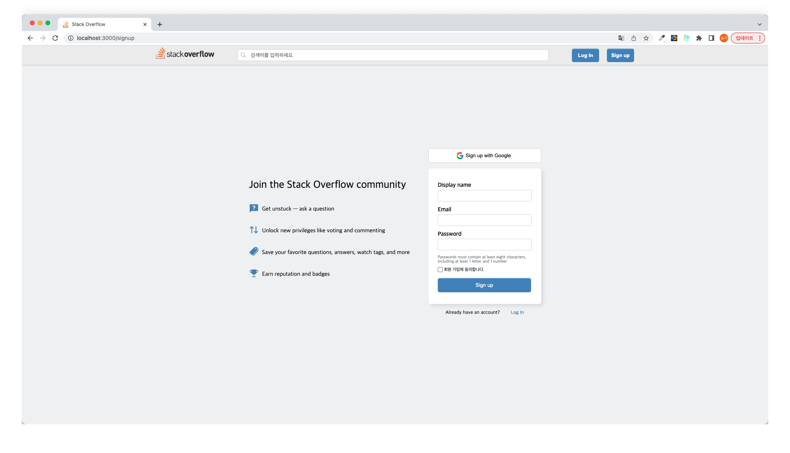
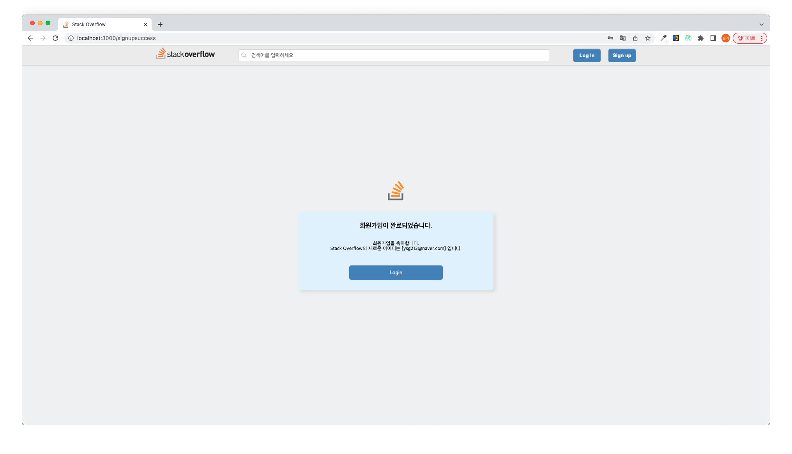
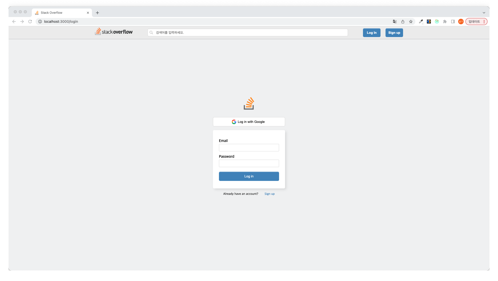
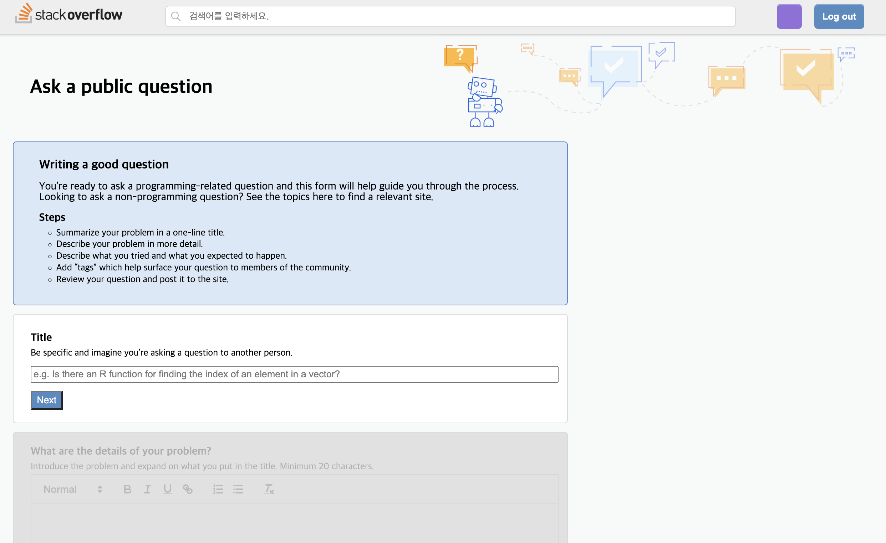
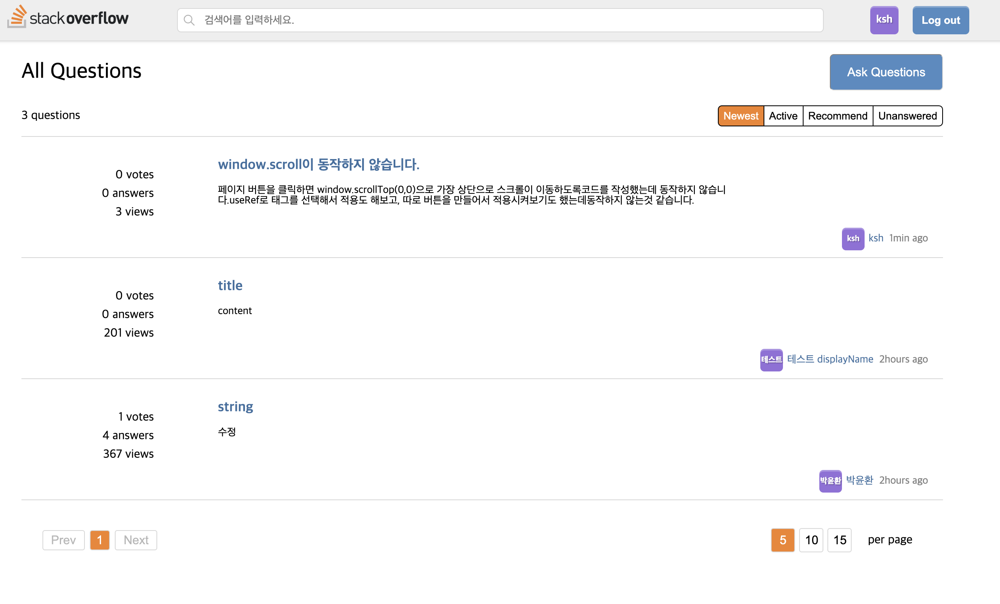

--------------------------------------------------------------
* 팀 명 : 🍑 2Pro
* 프로젝트명 : Stackoverflow clone
* 프로젝트 소개 : 개발자 질의 응답 커뮤니티 Stackoverflow clone
* 프로젝트 기간 : 2023.04.11 - 2023.04.27
* 배포링크: http://stackoverflow-clone.s3-website.ap-northeast-2.amazonaws.com/
 
 

## Team
### 🌅 Front-end

|Frontend (팀장)|Frontend|Frontend|Frontend|
| :---: | :---: | :---: | :---: |
|  |  |  | |
|[유슬기](https://github.com/Seulgi-Yoo)|[김수현](https://github.com/kimsh322)|[박윤환](https://github.com/yunhwan98)|[박지원](https://github.com/zi0ne)|

 

### 🌅 Back-end

|Backend (팀장)|Backend|Backend|
| :---: | :---: | :---: |
|  |  |  |
|[김상래](https://github.com/ksr0818)|[노유선](https://github.com/YUSUNRO)|[정승호](https://github.com/1111jsh)|

 

## Demo
|회원가입|회원가입성공|로그인/로그아웃|
| :---: | :---: | :---: |
||||
|이메일 형식의 아이디와 패스워드를 사용자가 직접 입력하여 가입한다.   회원 가입 시 별도 이메일 인증 과정은 생략한다.   이미 가입되어 있는 이메일로는 회원 가입이 불가능하다.   Sign up 버튼 클릭시  Display name, Email, Password 입력 받는 창이 나타난다.   - Display name, Email, Password는 필수값이다.   - Email 형식 (aaa@aaa.aaa) 충족 여부 확인   - Password는 알파벳과 숫자가 1개 이상, 총 8자 이상|가입 성공 시 로그인 화면으로 이동할 수 있는 버튼이 있는 회원 가입 성공 페이지로 이동한다.   이메일 주소와 함께 회원 가입 성공 메시지를 띄운다|회원은 이메일과 비밀번호로 로그인을 할 수 있다.   - 로그인 성공시 질문 목록 페이지로 이동하고, 실패시 에러 메시지 출력   - 로그인 성공 시 헤더의 버튼이 변경된다.   - 변경된 헤더의 로그아웃 버튼 클릭 시 로그아웃된 후 홈 화면으로 이동한다.|
|질문작성|질문수정|답변수정|
||||
|질문 작성 페이지   - 각각의 input창에 focus시 오른쪽에 question helper 표시   - title 작성하고 next버튼 클릭시 detail box 활성화   - detail 작성 후 next 버튼 클릭시 tryAndExpect box 활성화    - tryAndExpect 작성 후 next 버튼 클릭시 submit 버튼 활성화   - submit 버튼 클릭시 제출여부 결정하는 Modal창 표시, Yes를 누르면 질문 작성 POST 요청|||
|마이프로필|마이액티비티|프로필수정|
||||
||||
|유저프로필|유저액티비티|질문리스트페이지|
|||
|||질문 리스트 페이지(Home)   - AskQuestion 버튼 클릭시 질문 작성 페이지 이동   - Filter 버튼을 누르면 각 조건에 맞게 필터링   - 질문 title누르면 질문 상세 페이지 이동, username 클릭시 userprofile 페이지로 이동   - 페이지 버튼 누르면 각 페이지로 이동, 페이지당 질문 수 버튼누르면 페이지당 질문수 변경|

 

## ⚙ Tech Stack
### 🌅 Front-end
          

### 🌄 Back-end
                  

### 🔐 Server
  

 

## Git
### Branch
* main : 서비스 운영 브랜치
* dev : 개발중인 브랜치
* feat/기능명 : 기능 개발 브랜치

### Commit Message
|Message	|설명|
|:---:|:---:|
|Feat | 새로운 기능 추가|
|Fix | 버그 수정|
|Docs | 문서 수정|
|style | 코드 포맷팅, 세미콜론(;) 누락, 코드 변경이 없는 경우|
|Refactor | 코드 리팩터링|
|Test | 테스트 코드, 리팩터링 테스트 코드 추가|
|Chore | 빌드 업무 수정, 패키지 매니저 수정|
|Rename | 파일 혹은 폴더명을 수정하거나 경로 이동|
|Remove | 파일을 삭제|
