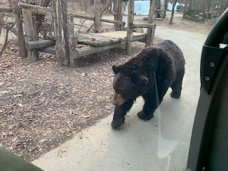

--------------------------------------------------------------
* 팀 명 : 🍑 2Pro
* 프로젝트명 : Stackoverflow clone
* 프로젝트 소개 : 개발자 질의 응답 커뮤니티 Stackoverflow clone
* 프로젝트 기간 : 2023.04.11 - 2023.04.27
* 배포링크: 
 
 

## Team
### 🌅 Front-end

|Frontend (팀장)|Frontend|Frontend|Frontend|
| :---: | :---: | :---: | :---: |
|  |  |  | |
|[유슬기](https://github.com/Seulgi-Yoo)|[김수현](https://github.com/kimsh322)|[박윤환](https://github.com/yunhwan98)|[박지원](https://github.com/zi0ne)|

 

## ⚙ Tech Stack
### 🌅 Front-end
          

### 🌄 Back-end

### 🔐 Server
  

 

## Git
### Branch
* main : 서비스 운영 브랜치
* dev : 개발중인 브랜치
* feat/기능명 : 기능 개발 브랜치

### Commit Message
|Message	|설명|
|:---:|:---:|
|Feat | 새로운 기능 추가|
|Fix | 버그 수정|
|Docs | 문서 수정|
|style | 코드 포맷팅, 세미콜론(;) 누락, 코드 변경이 없는 경우|
|Refactor | 코드 리팩터링|
|Test | 테스트 코드, 리팩터링 테스트 코드 추가|
|Chore | 빌드 업무 수정, 패키지 매니저 수정|
|Rename | 파일 혹은 폴더명을 수정하거나 경로 이동|
|Remove | 파일을 삭제|
